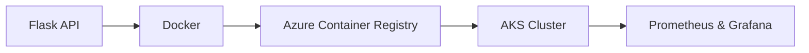

# Flask-K8s-Devops 🚀

> A comprehensive, hands-on DevOps project focused on building, containerizing, and deploying a scalable Flask API to Azure Kubernetes Service.


---

## 📑 Table of Contents

- [Architecture](#-architecture-overview)
- [Tech Stack](#-tech-stack)
- [Getting Started](#-getting-started)
- [Monitoring](#-monitoring)
- [Learning Goals](#-learning-goals)
- [Troubleshooting](#-troubleshooting)

---

## 🏗 Architecture Overview



---

## 🛠 Tech Stack

| Category   | Tools                     |
| ---------- | ------------------------- |
| Cloud      | Azure (AKS, ACR)          |
| IaC        | Terraform, Azure CLI      |
| Containers | Docker, Python            |
| Monitoring | Prometheus, Grafana, Helm |
| CI/CD      | GitHub Actions            |

---

## 🚀 Getting Started

### Prerequisites

- [Azure CLI](https://learn.microsoft.com/en-us/cli/azure/install-azure-cli) installed and configured
- [Terraform](https://developer.hashicorp.com/terraform/install) installed
- [Docker Desktop](https://www.docker.com/products/docker-desktop/) installed
- An active Azure subscription

### Deployment Steps

**1. Clone the repository**

```bash
git clone https://github.com/your-username/flask-k8s-devops.git
cd flask-k8s-devops
```

**2. Log in to Azure**

```bash
az login
```

**3. Initialize Terraform**

```bash
cd terraform
terraform init
```

**4. Provision Infrastructure**

```bash
terraform plan     # Preview changes
terraform apply -auto-approve
```

**5. Build & Push Docker Image**

```bash
# Build the Flask app image
docker build -t flask-app .

# Tag and push to ACR
az acr login --name <your-acr-name>
docker tag flask-app <your-acr-name>.azurecr.io/flask-app:latest
docker push <your-acr-name>.azurecr.io/flask-app:latest
```

**6. Deploy to AKS**

```bash
az aks get-credentials --resource-group <your-rg> --name <your-cluster>
kubectl apply -f k8s/
```

---

## 📊 Monitoring

Prometheus and Grafana are deployed via Helm for observability.

```bash
# Add the Helm repo
helm repo add prometheus-community https://prometheus-community.github.io/helm-charts
helm repo update

# Install the stack
helm install monitoring prometheus-community/kube-prometheus-stack
```

Access Grafana:

```bash
kubectl port-forward svc/monitoring-grafana 3000:80
# Open http://localhost:3000 (default: admin / prom-operator)
```

---

## 📝 Learning Goals

- End-to-end automation with CI/CD pipelines
- Infrastructure as Code (IaC) with Terraform
- Container orchestration with Kubernetes on AKS
- Observability and monitoring for cloud-native apps

---

## 🔧 Troubleshooting

<details>
<summary><b>AKS node size / quota errors (e.g. standard_D2s_v3)</b></summary>

If you hit a quota error when provisioning:

1. Check your subscription quota in the Azure Portal under **Subscriptions → Usage + quotas**
2. Try an alternative VM size in `terraform/variables.tf`:

```hcl
variable "node_vm_size" {
  default = "Standard_B2s"  # Cheaper alternative
}
```

3. Or request a quota increase via the Azure Portal.

</details>

<details>
<summary><b>kubectl not connecting to cluster</b></summary>

```bash
az aks get-credentials --resource-group <your-rg> --name <your-cluster> --overwrite-existing
kubectl config current-context
```

</details>

---

_Built by Shrikar Kaduluri_
