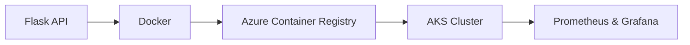
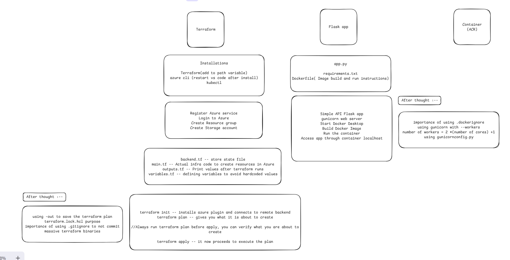
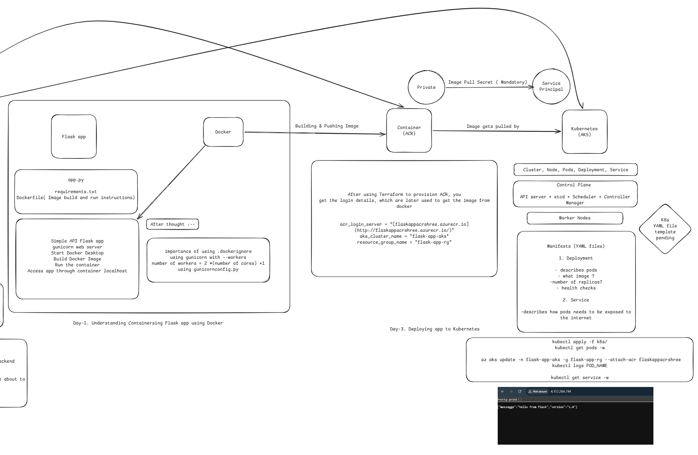

# Flask-K8s-Devops 🚀

> A comprehensive, hands-on DevOps project focused on building, containerizing, and deploying a scalable Flask API to Azure Kubernetes Service.


---

## 📑 Table of Contents

- [Architecture](#-architecture-overview)
- [Tech Stack](#-tech-stack)
- [Getting Started](#-getting-started)
- [Monitoring](#-monitoring)
- [Learning Goals](#-learning-goals)
- [Troubleshooting](#-troubleshooting)
- - [Development Journey](#-development-journey)
  - [Day 1 — Docker](#day-1--containerized-flask-app-with-docker)
  - [Day 2 — Terraform](#day-2--azure-infrastructure-with-terraform)
  - [Day 3 — AKS Deploy](#day-3--push-docker-image-to-acr--deploy-to-aks)

---

## 🏗 Architecture Overview



---

## 🛠 Tech Stack

| Category   | Tool           | Purpose                           | Docs                                                                |
| ---------- | -------------- | --------------------------------- | ------------------------------------------------------------------- |
| Cloud      | Azure AKS      | Managed Kubernetes cluster        | [Docs](https://learn.microsoft.com/en-us/azure/aks/)                |
| Cloud      | Azure ACR      | Container image registry          | [Docs](https://learn.microsoft.com/en-us/azure/container-registry/) |
| IaC        | Terraform      | Infrastructure provisioning       | [Docs](https://developer.hashicorp.com/terraform/docs)              |
| IaC        | Azure CLI      | Resource management via CLI       | [Docs](https://learn.microsoft.com/en-us/cli/azure/)                |
| Containers | Docker         | Image build & containerization    | [Docs](https://docs.docker.com/)                                    |
| Containers | Python / Flask | Application runtime & framework   | [Docs](https://flask.palletsprojects.com/)                          |
| Monitoring | Prometheus     | Metrics collection & alerting     | [Docs](https://prometheus.io/docs/)                                 |
| Monitoring | Grafana        | Dashboards & visualization        | [Docs](https://grafana.com/docs/)                                   |
| Monitoring | Helm           | Kubernetes package manager        | [Docs](https://helm.sh/docs/)                                       |
| CI/CD      | GitHub Actions | Automated build & deploy pipeline | [Docs](https://docs.github.com/en/actions)                          |

---

## 🚀 Getting Started

### Prerequisites

- [Azure CLI](https://learn.microsoft.com/en-us/cli/azure/install-azure-cli) installed and configured
- [Terraform](https://developer.hashicorp.com/terraform/install) installed
- [Docker Desktop](https://www.docker.com/products/docker-desktop/) installed
- An active Azure subscription

### Deployment Steps

**1. Clone the repository**

```bash
git clone https://github.com/your-username/flask-k8s-devops.git
cd flask-k8s-devops
```

**2. Log in to Azure**

```bash
az login
```

**3. Initialize Terraform**

```bash
cd terraform
terraform init
```

**4. Provision infrastructure**

```bash
terraform plan          # Preview changes
terraform apply -auto-approve
```

**5. Build & push Docker image**

```bash
# Build the Flask app image
docker build -t flask-app .

# Tag and push to ACR
az acr login --name <your-acr-name>
docker tag flask-app <your-acr-name>.azurecr.io/flask-app:latest
docker push <your-acr-name>.azurecr.io/flask-app:latest
```

**6. Deploy to AKS**

```bash
az aks get-credentials --resource-group <your-rg> --name <your-cluster>
kubectl apply -f k8s/
```

---

## 📊 Monitoring

Prometheus and Grafana are deployed via Helm for observability.

```bash
# Add the Helm repo
helm repo add prometheus-community https://prometheus-community.github.io/helm-charts
helm repo update

# Install the stack
helm install monitoring prometheus-community/kube-prometheus-stack
```

Access Grafana:

```bash
kubectl port-forward svc/monitoring-grafana 3000:80
# Open http://localhost:3000 (default credentials: admin / prom-operator)
```

---

## 📝 Learning Goals

- End-to-end automation with CI/CD pipelines
- Infrastructure as Code (IaC) with Terraform
- Container orchestration with Kubernetes on AKS
- Observability and monitoring for cloud-native apps

---

## 🔧 Troubleshooting

<details>
<summary><b>AKS node size / quota errors (e.g. standard_D2s_v3)</b></summary>

If you hit a quota error when provisioning:

1. Check your subscription quota in the Azure Portal under **Subscriptions → Usage + quotas**
2. Try an alternative VM size in `terraform/variables.tf`:

```hcl
variable "node_vm_size" {
  default = "Standard_B2s"  # Cheaper alternative
}
```

3. Or request a quota increase via the Azure Portal.

</details>

<details>
<summary><b>kubectl not connecting to cluster</b></summary>

```bash
az aks get-credentials --resource-group <your-rg> --name <your-cluster> --overwrite-existing
kubectl config current-context
```

</details>

---

_Built by Shrikar Kaduluri_

---

## 🗺 Development Journey

> This section documents the real build order, decisions, and errors encountered — useful for anyone learning DevOps by doing.

---

### Day 1 — Containerized Flask app with Docker

**What I built:**

- A lightweight Flask API (`app.py`) with no frontend — focused purely on DevOps execution
- Used `gunicorn` as the production web server (workers = `2 * CPU cores + 1`)
- Wrote a `Dockerfile` with image build and run instructions
- Added `gunicornconfig.py` for worker configuration

**Key files:** `app.py`, `requirements.txt`, `Dockerfile`, `gunicornconfig.py`

**Commands:**

```bash
docker build -t flask-app .
docker run -p 5000:5000 flask-app
# Access at http://localhost:5000
```

**Learnings:**

- `framework vs library` — Flask is a lightweight framework (gives you structure), a library is just a tool you call
- `.dockerignore` is important — keeps unnecessary files out of the image
- `gunicorn --workers` flag controls concurrency; formula: `2 * (num cores) + 1`

---

### Day 2 — Azure Infrastructure with Terraform

**What I built:**

- Provisioned Azure infrastructure using Terraform (IaC)
- Created: Resource Group → Storage Account → Blob Container (for remote state) → ACR → AKS
- Stored Terraform state file remotely in Azure Blob Storage to avoid local corruption

**Key files:** `terraform/backend.tf`, `terraform/main.tf`, `terraform/variables.tf`, `terraform/outputs.tf`

**Commands:**

```bash
az login --tenant <your-directory-id>
terraform init     # installs Azure plugin, connects to remote backend
terraform plan     # preview what will be created
terraform apply    # execute the plan
```

**Errors & fixes:**

<details>
<summary><b>SubscriptionNotFound error when creating storage account</b></summary>

**Error:**

```
(SubscriptionNotFound) Subscription 2268067b-... was not found.
```

**Cause:** The `Microsoft.Storage` resource provider was not registered in the subscription. Azure requires explicit registration before using a service.

**Fix:** Register the resource provider manually in the Azure Portal or via CLI:

```bash
az provider register --namespace Microsoft.Storage
```

</details>

<details>
<summary><b>AKS creation failed — VM size not allowed (Standard_B2s / D-series)</b></summary>

**Cause:** Azure trial accounts restrict which VM sizes can be used per region for AKS nodes.

**Fix:** ACR and Resource Group were in `eastus`; switched AKS specifically to `eastus2` which allowed the node pool to provision successfully.

</details>

<details>
<summary><b>GitHub Desktop warning about massive file commits</b></summary>

**Cause:** The `.terraform/` directory contains large binary provider plugins that should never be committed.

**Fix:** Added a `.gitignore` with:

```
.terraform/
terraform.tfstate
terraform.tfstate.backup
*.tfplan
```

</details>

**Terraform outputs:**

```
acr_login_server    = "flaskappacrshree.azurecr.io"
aks_cluster_name    = "flask-app-aks"
resource_group_name = "flask-app-rg"
```

**Learnings:**

- Always run `terraform plan` before `apply` — verify before you create
- `backend.tf` stores the state file remotely so it's safe and team-accessible
- `variables.tf` avoids hardcoded values; `outputs.tf` prints useful values after apply
- `terraform.lock.hcl` locks provider versions for reproducibility
- Adding Terraform to the system PATH lets your terminal recognize the `terraform` command

---

## 🗂 Project Flow Diagram

> Architecture and flow reference used during development.

<!-- Add your flow diagram image to docs/flow.png in the repo, then this will render automatically -->
### Day 1 + Day 2


### Day 3 — Push Docker Image to ACR & Deploy to AKS
 
**What I built:**
 
- Tagged and pushed the Flask Docker image to Azure Container Registry (ACR)
- Wrote Kubernetes manifests: a `Deployment` (pods, replicas, health checks) and a `Service` (external exposure)
- Deployed the app to AKS and verified it was running via `kubectl`
**Key files:** `k8s/deployment.yaml`, `k8s/service.yaml`
 
**Commands:**
 
```bash
# Set ACR server (PowerShell)
$env:ACR_SERVER="flaskappacrshree.azurecr.io"
 
# Log in to ACR and build image
az acr login --name flaskappacrshree
docker build -t $env:ACR_SERVER/flask-app:v1 .
 
# Tag as latest and push both
docker tag $env:ACR_SERVER/flask-app:v1 $env:ACR_SERVER/flask-app:latest
docker push $env:ACR_SERVER/flask-app:v1
docker push $env:ACR_SERVER/flask-app:latest
 
# Deploy manifests to AKS
kubectl apply -f k8s/
 
# Watch pod status
kubectl get pods -w
 
# Watch service for external IP
kubectl get service -w
 
# Re-attach ACR permissions to AKS (if needed)
az aks update -n flask-app-aks -g flask-app-rg --attach-acr flaskappacrshree
```
 
**Errors & fixes:**
 
<details>
<summary><b>Docker daemon not running — DOCKER_COMMAND_ERROR</b></summary>
**Error:**
 
```
failed to connect to the docker API at npipe:////./pipe/dockerDesktopLinuxEngine
```
 
**Cause:** Docker Desktop was not running.
 
**Fix:** Open Docker Desktop, wait for it to start, then re-run the command.
 
</details>
<details>
<summary><b>Invalid tag format in PowerShell — invalid reference format</b></summary>
**Error:**
 
```
ERROR: invalid tag "/flask-app:v1": invalid reference format
```
 
**Cause:** Using `$ACR_SERVER` instead of `$env:ACR_SERVER` in PowerShell — the variable wasn't being resolved.
 
**Fix:**
 
```powershell
docker build -t $env:ACR_SERVER/flask-app:v1 .
```
 
</details>
<details>
<summary><b>Liveness/readiness probe fields in wrong YAML location</b></summary>
**Error:**
 
```
strict decoding error: unknown field "spec.template.spec.containers[0].livenessProbe.path"
unknown field "spec.template.spec.containers[0].livenessProbe.port"
```
 
**Cause:** `path` and `port` were placed directly under `livenessProbe` / `readinessProbe` instead of nested under `httpGet`.
 
**Fix:** Move them inside the `httpGet` block:
 
```yaml
livenessProbe:
  httpGet:
    path: /health
    port: 5000
```
 
</details>
<details>
<summary><b>ImagePullBackOff — pods stuck, can't pull from ACR</b></summary>
**Error:**
 
```
ErrImagePull → ImagePullBackOff
```
 
**Cause:** Azure free trial had expired, causing the AKS → ACR permission attachment to break.
 
**Fix:** Upgraded to Pay-As-You-Go and re-attached ACR permissions:
 
```bash
az aks update -n flask-app-aks -g flask-app-rg --attach-acr flaskappacrshree
```
 
</details>
**Learnings:**
 
- Kubernetes manifests describe *desired state* — `Deployment` manages pods and replicas; `Service` exposes them externally
- Use `latest` tag in manifests during development to avoid updating the tag name every deploy; use versioned tags in production
- Docker is smart about layers — pushing a re-tagged image doesn't re-upload layers that already exist in the registry (it just updates the pointer)
- In PowerShell, environment variables must use `$env:VAR_NAME` syntax, not `$VAR_NAME`
- `livenessProbe` and `readinessProbe` fields (`path`, `port`) must be nested under `httpGet`, not at the probe root level
- AKS needs explicit permission (`--attach-acr`) to pull images from ACR — this can break if subscription access changes


## 🗂 Project Flow Diagram

> Architecture and flow reference used during development.

<!-- Add your flow diagram image to docs/flow.png in the repo, then this will render automatically -->
### Day 3


### Day 4 — _(coming soon)_

> GitHub Actions CI/CD pipeline

---

### Day 5 — _(coming soon)_

> Prometheus + Grafana monitoring

---


